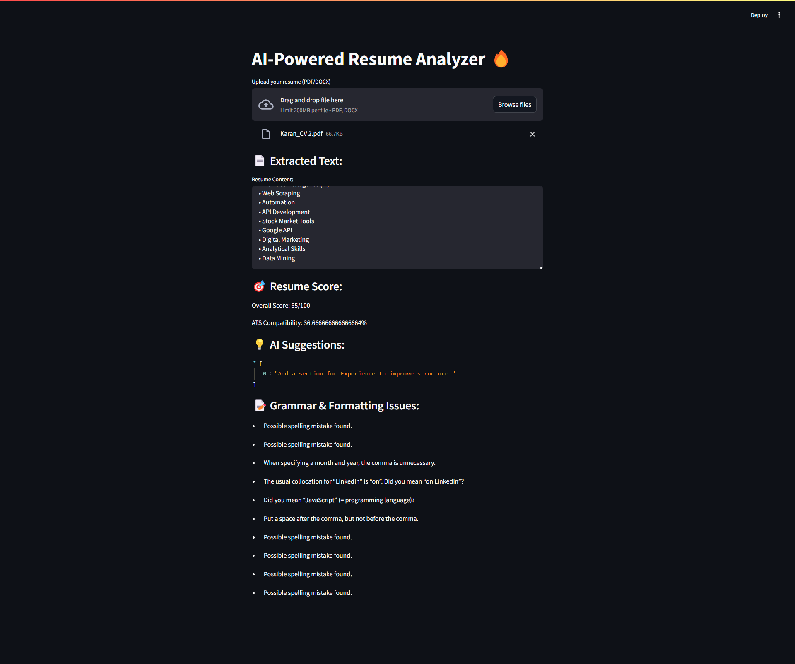

# AI-Powered Resume Analyzer

## 🚀 Overview
This project is an AI-powered resume analyzer built using **Streamlit, PDF/DOCX processing, NLP**, and **ATS compatibility checking**. It extracts text, analyzes skills, scores resumes, and provides AI-driven suggestions to improve resumes.

## 📂 Directory Structure
```
📦 Resume-Analyzer
├── 📂 src/              # Source code
├── 📂 docs/             # Documentation
├── 📂 tests/            # Test cases
├── 📂 assets/           # Images/screenshots (if needed)
├── 📂 .github/workflows/ # GitHub Actions for automation (optional)
├── 📄 README.md         # Project Overview
├── 📄 requirements.txt  # Dependencies
├── 📄 .gitignore        # Ignore unnecessary files
├── 📄 LICENSE           # Open-source license (optional)
```

## 🌟 Features
✅ Extract text from **PDF/DOCX** resumes  
✅ Identify **technical & soft skills**  
✅ Score resumes based on **AI analysis**  
✅ Check **ATS compatibility** for job applications  
✅ AI-generated **resume improvement suggestions**  
✅ **Grammar & formatting** error detection  

## 🔧 Installation
1. Clone the repository:
   ```bash
   git clone https://github.com/your-username/resume-analyzer.git
   cd resume-analyzer
   ```
2. Install dependencies:
   ```bash
   pip install -r requirements.txt
   ```
3. Run the app:
   ```bash
   streamlit run app.py
   ```

## 📝 Usage
- Upload your resume (**PDF/DOCX**)
- View extracted text & detected skills
- Get AI-generated suggestions & ATS score
- Improve your resume based on feedback

## 📷 Screenshots


## 🤝 Contributing
Feel free to **fork this repo, submit PRs**, and improve it! 😊

## 📜 License
This project is open-source under the **MIT License**.

---

💡 **Enhance your resume with AI & land your dream job!** 🚀

